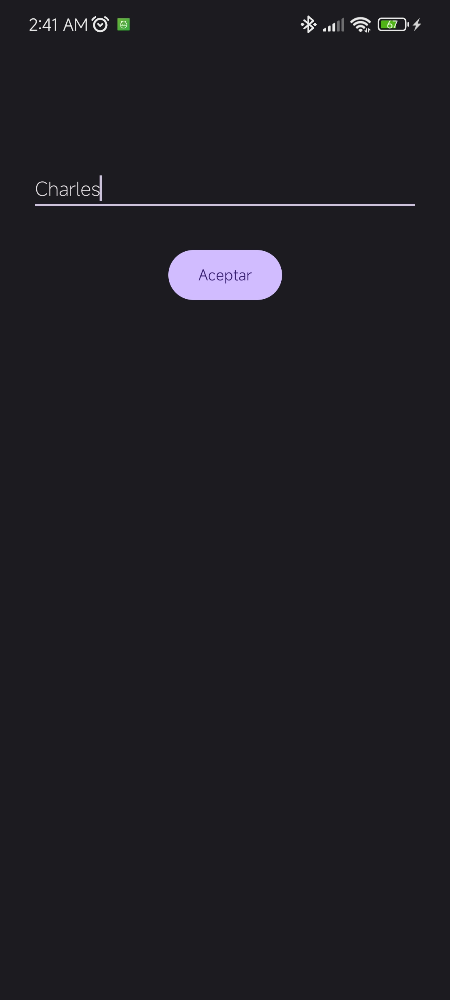

# Aplicación de Saludo Personalizado

## Descripción
Esta es una pequeña aplicación de Android que muestra cómo pasar datos entre actividades. El usuario ingresa su nombre en la pantalla principal y, al presionar el botón "Aceptar", se muestra una segunda pantalla con un saludo personalizado.

   
   

## Funcionalidades
- Campo de entrada para el nombre del usuario
- Botón para enviar los datos
- Segunda pantalla que muestra un mensaje personalizado

## Componentes principales
1. **MainActivity**: 
   - Contiene un EditText para la entrada de texto
   - Incluye un botón que inicia la segunda actividad
   - Envía el nombre ingresado a través de un Intent

2. **SaludoActivity**:
   - Recibe el nombre desde el Intent
   - Muestra un saludo personalizado con el nombre recibido

## Cómo funciona
1. El usuario ingresa su nombre en la pantalla principal
2. Al hacer clic en "Aceptar", la aplicación captura el texto ingresado
3. Se crea un Intent para iniciar SaludoActivity, pasando el nombre como extra
4. SaludoActivity recibe el Intent, extrae el nombre y muestra "Hola [nombre]"

## Estructura del proyecto
- **MainActivity.kt**: Actividad principal que maneja la entrada de datos
- **SaludoActivity.kt**: Actividad que muestra el saludo personalizado
- **activity_main.xml**: Layout de la pantalla principal
- **activity_saludo.xml**: Layout de la pantalla de saludo
- **AndroidManifest.xml**: Configuración de las actividades de la aplicación

## Conceptos demostrados
- Manejo de entrada de texto con EditText
- Paso de datos entre actividades usando Intent
- Ciclo de vida básico de Activity
- Diseño de layouts con ConstraintLayout

## Requisitos
- Android Studio
- SDK mínimo: Android 5.0 (API level 21) o superior
